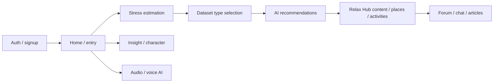

# PeacePlot — Product & build plan

This document is the **project-level plan** for the PeacePlot healthcare app (stress reduction). **Implementation work should follow this plan**, the **functional requirements** captured below, and the repo’s **`design/`** reference (§2). Visual specs follow **`design/xhtml/`** patterns with a **dark theme and blue accent** (§2.2).

Companion document: [`research.md`](./research.md) (industry notes and design rationale).

---

## 1. Vision

Help users **understand and reduce stress** through **AI-assisted estimation**, **character-aware** guidance, a rich **content library**, and **community** features—delivered in a **calm, trustworthy** mobile-first experience. Visual and interaction design follows the **Soziety-based reference in `design/`** (headers, lists, cards, drawers, bottom navigation). Industry patterns from established wellness apps inform defaults only where this plan does not specify otherwise.

---

## 2. Design source of truth (`design/` folder)

### 2.1 What’s in the repo

The **`design/`** tree is the **Mobile Soziety–style** template (Bootstrap 5 + SCSS + static HTML). Treat it as **layout and component vocabulary**, not as shipped code:

| Area                      | Location                                                                 | Use for PeacePlot                                                                                                                                         |
| ------------------------- | ------------------------------------------------------------------------ | --------------------------------------------------------------------------------------------------------------------------------------------------------- |
| **Compiled UI & pages**   | `design/xhtml/` — HTML screens, `assets/css/style.css`, images           | Screen structure: `header` / `main-bar`, `page-wraper`, lists, cards, forms, tabs, **sidebar/offcanvas** patterns for the drawer, bottom tab bar density. |
| **Theme tokens (source)** | `design/xhtml/assets/scss/layout/theme/_theme-color.scss`                | Accent palettes via `data-theme-color="color-*"` presets.                                                                                                 |
| **Dark theme overrides**  | `design/xhtml/assets/scss/layout/theme/_theme-view.scss` (`.theme-dark`) | Dark surfaces, text, borders, form fields, header behavior.                                                                                               |
| **Global variables**      | `design/xhtml/assets/scss/abstracts/_variable.scss`                      | Typography, radii (`--border-radius-base` ≈ 12px), `:root` CSS variables.                                                                                 |
| **Vendor docs**           | `design/documentation/`                                                  | Installation and folder overview only.                                                                                                                    |

**Fonts:** **Nunito Sans** and **Poppins** (see `design/xhtml/index.html`). Plan to load the same (or closest Expo equivalent) for parity.

**Behavioral note:** The template toggles dark via **`body.theme-dark`**. PeacePlot **defaults to dark**; tokens in **§2.2** apply.

### 2.2 Product direction: dark theme + blue accent

The template’s default accent is **orange** (`#FE9063` in `_variable.scss`). **PeacePlot uses dark surfaces + blue primary:**

- **Accent (use `color-blue` block in `_theme-color.scss`):** `--primary` `#2196f3`, `--primary-hover` `#0c7cd5`, `--primary-dark` `#064475`, `--primary-light-2` `#8ecdff`, blue `--gradient*` / `--rgba-primary-*`.
- **Dark (`.theme-dark`):** surface **`#2c3f6d`**, header glass **`--bg-dark-light`** `rgba(44, 63, 109, 0.80)`, text **`rgba(255, 255, 255, 0.7)`**, headings **`#fff`**, borders **`rgba(255, 255, 255, 0.2)`**, muted **`rgba(255, 255, 255, 0.5)`**.
- **Rule:** Implement **dark + blue** consistently; do not ship the template’s orange primary unless the owner revises this plan.

### 2.3 Expo translation (plan-level)

- **Single theme module** mirroring §2.2 (and naming aligned to template `--*` variables where useful).
- **Components** rebuilt from **`design/xhtml/`** with React Native + shared primitives; match **spacing, ~12px radius, header and bottom bar structure**.
- **Gradients:** `expo-linear-gradient` (or equivalent) for blue gradients from `_theme-color.scss`.
- **Icons:** One consistent approach (`@expo/vector-icons` and/or SVG); map roles (nav, header actions, status), not necessarily every template glyph.
- **Branding & loading:** Use repo assets in **`assets/images/`** per **§2.4** (not the Soziety template logos).

### 2.4 PeacePlot brand assets & loading animation

**Canonical paths (repo root–relative):**

| Asset | Path | Use |
| ----- | ---- | --- |
| **Primary logo** | **`assets/images/peaceplot.png`** | **Header** (§4.1), **auth / welcome** branding, **drawer** header, **splash** companion if a wordmark is needed beside the loading mark, **share** previews where appropriate. |
| **Loading / splash mark** | **`assets/images/peaceplot-loading.png`** | **App launch splash**, **full-screen loading** states (initial data fetch, auth bootstrap, heavy transitions), and **inline blocking loaders** where a centered brand treatment is preferred over a bare spinner. |

**Visual fit with §2.2:** The logo artwork is **blue-forward** with **gold / highlight** accents and **liquid / water** motifs (wordmark and circular mark with lotus). Implementation should place both assets on **dark** surfaces from **§2.2** so cyan–gold gradients read clearly; avoid light-gray page backgrounds behind **`peaceplot-loading.png`** unless the PNG is exported with **true transparency** for dark UI.

**Loading animation (quality bar — calm, premium, not frantic):**

- **Primary treatment:** Animate **`peaceplot-loading.png`** with a **slow “breathing” scale** (e.g. subtle pulse on the central orb) and/or **soft opacity oscillation** on a **long period** (2.5–4s) so it feels meditative, not like a system busy indicator.
- **Secondary accents (optional, pick one or combine lightly):** **Gentle shimmer** (moving linear gradient mask or very low-amplitude highlight sweep) across the liquid/water areas; **slow rotation** only if it matches the asset’s circular splash frame—keep **RPM low** (e.g. one full turn in **20–40s**) or **none** if rotation feels gimmicky.
- **Entry / exit:** Short **fade-in** when showing loading; **fade-out** or **crossfade** into content—avoid **hard cuts** that spike stress in a stress-reduction app.
- **Duration:** Cap **splash** display (e.g. hide when app is ready, with a **maximum** time before showing UI even if a resource is slow); avoid infinite logo spinners on cold start.
- **Accessibility:** Respect **Reduce motion** OS settings: replace or dampen scale/rotation/shimmer with a **static** centered image + optional **minimal** progress indicator.
- **Tech note (implementation):** Prefer **`react-native-reanimated`** (or Expo-supported animation APIs) for 60fps-friendly transforms; for web, **CSS** `@media (prefers-reduced-motion: reduce)` mirrors the same intent.

**Do not** reuse **`peaceplot-loading.png`** as the small header glyph—**`peaceplot.png`** is the **navigation / UI chrome** logo; **`peaceplot-loading.png`** is for **large, centered loading / splash** contexts.

### 2.5 Reference HTML files (patterns, not 1:1 pages)

- **Auth:** `login.html`, `register.html`, `welcome.html`, `otp-confirm.html`.
- **Profile / settings:** `account.html`, `setting.html`, `profile.html`.
- **Feeds, lists, notifications:** `index.html`, `notification.html` — density for **Relax Hub**, **Forum**, and **Insight** lists.
- **Drawer / menu:** Template **menu-toggler** / offcanvas patterns — map to **left drawer** triggered by the header grid icon (§4.2).
- **Messaging / social:** `message`-related HTML where present — patterns for **chat rooms** and **chatbot** threads.

---

## 3. Core product logic & user journey

### 3.1 Main point (system behavior)

1. **AI-driven stress estimation** produces a result that, together with **character profile** data, feeds **automatic recommendations** for stress-relief methods.
2. **Gating step (required):** After stress estimation completes and **before** the user receives **AI recommendations**, they must **select which dataset types** they are interested in (see §5.2). Recommendations are then scoped or weighted by those choices.
3. **Voice AI agent:** A **voice-forward assistant** should drive **as many app functions as practical** (navigation, starting flows, playback control, search—exact scope phased; see §5.5). The **Audio** tab is the primary home for voice and audio experiences (§4.2).
4. **Location-aware suggestions:** Recommend **local “famous” or notable places** that may help ease stress, **scoped by country or locality** (privacy, permissions, and data sourcing to be defined in implementation).
5. **Trust layer:** Surface **credentialed or “famous stress doctor”** content (biographies, articles, books, videos, speeches) to build user confidence (§5.4).

### 3.2 Typical journey (high level)

Repeat visits: users return to **Insight** for history, **Relax Hub** for library content, **Forum** for community, **Audio** for voice and audio modalities.

### 3.3 Character analysis

- **Purpose:** Inform **personalization** of estimation interpretation and recommendations.
- **Mechanism:** **Question-based** flows (“questions or similar”)—can be a dedicated flow and/or ongoing prompts; results feed the **character** model used with estimation outputs.

---

## 4. Information architecture, page structure & behavior

This section fixes **navigation** and **shell UI** so implementation matches the owner’s spec while staying aligned with **`design/`** (fixed header, bottom tabs, drawer).

### 4.1 Global shell (most authenticated screens)

- **Layout:** Follow **`design/xhtml/`** `page-wraper` + **fixed header** + **scrollable content** + **bottom tab bar** (template bottom navigation spacing and safe areas).
- **Header — left:** App logo **`assets/images/peaceplot.png`** (not the Soziety template logo). Scale for header height; preserve aspect ratio.
- **Header — right (three actions):**
  1. **Chat** — entry to **messaging / chat rooms** (and/or chatbot entry, depending on product routing).
  2. **Notifications** — alerts (estimation reminders, replies, system); list/detail pattern like `notification.html`.
  3. **Four-square (grid) icon** — opens a **left-side drawer** (off-canvas menu). Use template **drawer / sidebar** interaction patterns. Menu items will **grow over time**; architect routes as a **configurable list** (profile, settings, trust/doctors, help, legal, future entries).

### 4.2 Bottom navigation (five tabs, fixed)

| Tab           | Working name | Primary purpose                                                                                   | Notes                                                                                                                                                               |
| ------------- | ------------ | ------------------------------------------------------------------------------------------------- | ------------------------------------------------------------------------------------------------------------------------------------------------------------------- |
| **Home**      | `home`       | Dashboard, entry to **stress estimation**, shortcuts, trust teasers, maybe **local places** entry | Template `index.html`-style feed/dashboard density where useful.                                                                                                    |
| **Insight**   | `insight`    | **Stress history**, **estimation results** over time, **character analysis** outputs, trends      | Charts/cards; reference list/card components from `design/`.                                                                                                        |
| **Audio**     | `audio`      | **Voice AI agent**, **music**, **story/audio** content, speech-related estimation affordances     | Central place for **voice** and **audio datasets**; voice agent deep-links from here. Replaces older “voice-only slot in tab bar” ideas—**Audio is the voice tab**. |
| **Relax Hub** | `relax-hub`  | **Dataset library:** books, video, image, story, music, **Yoga & Tai Chi**, **AI advice** content | Browse/filter by type; aligns with “datasets” in requirements.                                                                                                      |
| **Forum**     | `forum`      | **Articles**, **chat rooms**, **chatbot** access, community                                       | Article list/detail, threaded discussion surfaces; see §5.3.                                                                                                        |

**Expo routing note:** Map these to **`expo-router`** tab routes under a shared `(app)` layout with the **global header** and **theme** from §2.

### 4.3 Major screens (by feature area)

**Stress estimation (modal flow or stacked screens, can start from Home):**

- Channel selection or progressive disclosure for inputs: **questions**, **speech-to-text**, **camera (face)**, **fingerprint**, **smart watch** (see phasing §7).
- **Mandatory intermediate screen:** **Dataset type selection** (multi-select or categories) **after** estimation, **before** recommendation results.

**Recommendations & AI advice:**

- Results screen(s) after gating: personalized **methods** and **content pointers** into Relax Hub / Forum / Audio as appropriate.
- **AI advice** as a **content type** and/or **inline** assistant copy—consistent with trust disclaimers (no medical claims unless compliance allows).

**Relax Hub:**

- **Books:** “Normal peaceful” books and **books from famous doctors** (filter or badges).
- **Media:** video, image, **story (including audio)**, music.
- **Activities:** **Yoga**, **Tai Chi** (sessions, lists, maybe video).
- **Places:** **Location-based** “famous places” (map/list), permission-gated.

**Forum & community:**

- **Articles** with **article management** (authoring/publishing flow—scope with backend).
- **Chat rooms** with **search for users by `userid` and email** (privacy and abuse considerations in implementation).
- **Chatbot** for automated Q&A / triage into content.
- **Comments:** **Threaded (“tree”) comments only** (no flat-only mode required).
- **Reactions:** **Thumb up / like** as specified; other reactions only if added later.

**Insight:**

- **Character analysis** summaries and **question** history.
- Estimation timeline and links to recommendations consumed.

**Audio:**

- **Voice AI** “command surface” and conversational UI.
- Playback for **music** and **story** audio; link-outs to estimation **speech-to-text** where relevant.

### 4.4 Authentication & account (behavior)

- **Sign-up fields:** `userid`, `useremail`, `avatar`, `password`.
- **`userid`:** **Globally unique**; **validate uniqueness** before completion (client checks + server authority).
- **OAuth providers:** **Google**, **Outlook (Microsoft)**, **Apple** — in addition to or paired with email/password per platform policy.
- **Sign-in / recovery:** Flows consistent with **`design/xhtml/`** auth pages and §2.2 styling.

---

## 5. Feature scope (detailed)

### 5.1 Stress estimation — input modalities

| Modality           | Role                                      | Planning note                                                                   |
| ------------------ | ----------------------------------------- | ------------------------------------------------------------------------------- |
| **Questions**      | Structured assessment                     | Core; drives scoring with AI layer.                                             |
| **Speech-to-text** | Voice answers or journaling               | Core; ties to **Audio** and **Voice AI** stack.                                 |
| **Camera (face)**  | Signals for estimation (or future affect) | **Privacy-sensitive**; explicit consent, platform rules, phased delivery.       |
| **Fingerprint**    | Biometric convenience or signal           | Often **auth** vs. stress signal—clarify product intent; platform APIs; phased. |
| **Smart watch**    | Physiological or activity context         | Integrate via HealthKit / Health Connect / wearables APIs; phased.              |

Estimation **combines** available signals with **AI** to produce results used in §3.

### 5.2 Datasets (Relax Hub / recommendations)

- **Books:** Leisure/peaceful reading + **doctor-curated** lists.
- **Media:** Video, image, **story** (with **audio**), **music**.
- **Activities:** **Yoga** and **Tai Chi**.
- **AI advice:** Short, actionable suggestions (template + model behavior TBD).
- **Ordering:** User **selects interested dataset types** after estimation and **before** full recommendation generation (§3.1).

### 5.3 Communities

- **Chatbot:** Automated assistance; may share UI patterns with chat rooms.
- **Article management:** Create/edit/publish pipeline—depth depends on backend/CMS choices.
- **Chat rooms:** Multi-user chat; **search users** by **`userid`** and **email**; moderation TBD.

### 5.4 Trust — “famous stress doctors”

- **Content types:** Biographies, articles, books, videos, speeches.
- **Surface in:** Home / Relax Hub / dedicated drawer entries as appropriate.

### 5.5 Voice AI agent (cross-cutting)

- **Goal:** Voice command and dialogue to **open tabs**, **start estimation**, **open Relax Hub filters**, **play audio**, **start chatbot**, etc., within platform limits.
- **Primary UI:** **Audio** tab + optional **floating** or **header-adjacent** entry if design requires parity with `design/` affordances.

---

## 6. Technical context (repository)

- **Stack:** Expo (~55), React Native, **expo-router** for navigation.
- **Platforms:** iOS, Android, Web (per Expo config).
- **Structure:** Tab layout for **§4.2**; nested stacks per tab; **drawer** for **§4.1** grid icon; shared header component with **`assets/images/peaceplot.png`**; **splash / global loading** uses **`assets/images/peaceplot-loading.png`** with motion per **§2.4**.

### 6.1 Backend: Supabase (single platform)

**Backend services are standardized on [Supabase](https://supabase.com/)** for the full product lifecycle: **Auth** (email/password, OAuth providers, session), **Postgres** (app data, RLS policies), **Storage** (avatars, media), **Realtime** (chat rooms, live updates), **Edge Functions** (optional: AI proxying, webhooks, integrations with third-party APIs without exposing secrets in the app).

**Environment configuration:**

- **`/.env.example`** — Committed template listing all required variables (no secrets). New developers copy it to **`.env`** and fill in project values.
- **`/.env`** — **Gitignored**; contains `EXPO_PUBLIC_SUPABASE_URL` and `EXPO_PUBLIC_SUPABASE_ANON_KEY` (and any optional `EXPO_PUBLIC_*` keys). Values come from **Supabase Dashboard → Project Settings → API**.
- **Expo rule:** Only variables prefixed with **`EXPO_PUBLIC_`** are available in the client bundle. The **`service_role`** key must **never** ship in the app; use it only in **Edge Functions**, **server scripts**, or **CI**, if at all.

**Client code:** `src/lib/supabase.ts` initializes the Supabase client with the anon key. Use **`requireSupabase()`** when the app must talk to the backend; handle `null` during early scaffolding if env vars are missing.

**Feature mapping (high level):**

| PeacePlot area | Supabase capability |
| -------------- | ------------------- |
| Sign-up / `userid` uniqueness / OAuth | Auth + Postgres unique constraints + profiles table |
| Avatars | Storage bucket + public/signed URLs |
| Stress history, character, recommendations | Postgres tables + RLS |
| Forum, articles, tree comments, likes | Postgres + optional Realtime |
| Chat rooms | Realtime channels and/or Postgres-backed messages |
| Voice / AI / external APIs | Edge Functions (secrets in Supabase env, not in Expo) |
| Location / places | Postgres + external APIs via Edge Functions if needed |

**Operational note:** Create the Supabase project early, apply schema and RLS in migrations (Supabase SQL editor or CLI), and align OAuth redirect URLs with the **Expo scheme** (`peaceplot` per `app.json`) and Supabase Auth settings.

---

## 7. Build phases (suggested)

1. **Design lock** — Freeze **§4** IA (tabs, header, drawer), **§2.2** tokens, **`assets/images/peaceplot.png`** / **`peaceplot-loading.png`** usage, and **§2.4** loading motion rules; list **design/** HTML references per tab.
2. **Shell & navigation** — **`expo-router`** tabs (**Home**, **Insight**, **Audio**, **Relax Hub**, **Forum**), global **header** + **left drawer**, **theme** (§2), **splash + loading** screen using **`peaceplot-loading.png`** with **§2.4** animation, placeholder inner screens.
3. **Supabase foundation** — Create project, configure **`.env`** from **`.env.example`**, wire **Auth** redirect URLs, baseline **schema** / **RLS** and **Storage** buckets per **§6.1**.
4. **Auth** — Email/password + **`userid` uniqueness** + avatar via **Supabase Auth** + profiles table; **OAuth** Google / Microsoft / Apple per **§6.1**.
5. **Stress estimation (MVP)** — **Questions** + **speech-to-text** path; result persistence; then **dataset type selection** → **recommendations** UI (can use mock AI).
6. **Insight** — History, character summary screens.
7. **Relax Hub** — Content browsing by type; hooks for **location** places.
8. **Forum** — Articles list/detail, **tree comments**, **likes**; **chat rooms** + **user search**; **chatbot** entry.
9. **Audio** — **Voice AI** integration (phased), music/story playback.
10. **Trust content** — Doctor content surfaces.
11. **Additional estimation channels** — Camera, fingerprint, smartwatch as prioritized.
12. **Polish** — Accessibility, **loading/empty** states (reuse **`peaceplot-loading`** treatment where full-screen; keep **§2.4** reduce-motion behavior), performance, App Store privacy strings.

---

## 8. Out of scope until explicitly scheduled

- **Clinical claims** or regulated medical device positioning without legal review.
- **Full moderation** and **admin** tooling for forums (unless specified).
- **Deep wearable** or **lab** integrations beyond agreed phases.
- Features explicitly deferred from **§7** until pulled into a sprint.
- **Non-Supabase backends** for core data/auth (unless the plan is formally revised)—integrations should go through **Supabase** (e.g. Edge Functions) where possible.

---

## 9. Change control

Updates to scope or phases should be recorded **in this file** (dated notes or version history) so the repo stays the single plan reference.

---

_Last updated: 2026-04-13_
