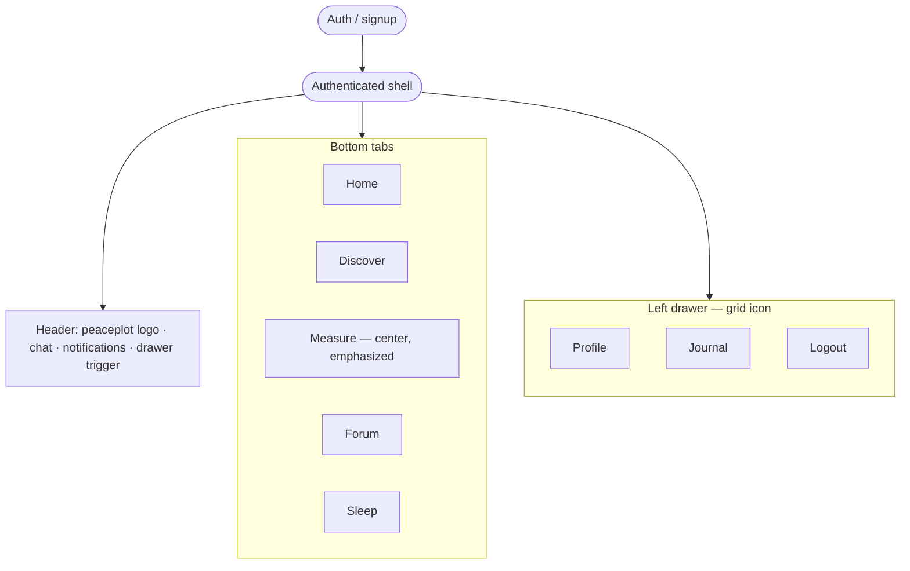
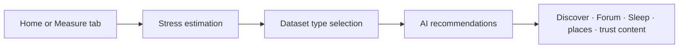

# PeacePlot — Product & build plan

This document is the **project-level plan** for the PeacePlot healthcare app (stress reduction). **Implementation work should follow this plan**, the **functional requirements** captured below, and the **`design/`**-based UI system (**§2**): **all** screens use that style, **dark theme** by default, **blue** primary accent.

Companion document: [`research.md`](./research.md) (industry notes and design rationale).

---

## 1. Vision

Help users **understand and reduce stress** through **AI-assisted estimation**, **character-aware** guidance, a rich **Discover** library, **sleep** support, and **community** features—delivered in a **calm, trustworthy** mobile-first experience. **Home** is the **landing** hub (doctor quotes + **2×2 Measure** grid); **Journal** lives in the **left drawer**, not the tab bar. **Every feature and page** should follow the **`design/`** templates (structure, spacing, typography, cards, lists, navigation) and the **dark + blue** theme (**§2**). Industry patterns from established wellness apps inform defaults only where this plan does not specify otherwise.

---

## 2. Design source of truth (`design/` folder)

### 2.0 Mandatory compliance — all features & pages

Building the app in Expo is **not** a greenfield visual redesign. The repo’s **`design/`** tree contains **many** HTML templates under **`design/xhtml/`** (auth, feeds, profile, settings, messaging, UI kits, etc.). Implementation **must**:

1. **Match the template style** — For each PeacePlot screen, identify the **closest** `design/xhtml/*.html` (or component pattern in `assets/css/style.css` / SCSS sources) and mirror **layout** (header, content area, lists, cards, forms, tabs, drawer), **density**, and **interaction rhythm** (e.g. scrollable body, fixed header, bottom bar safe area).
2. **Default theme: dark + blue** — Ship **dark surfaces** and **blue** primary (`§2.2`). Do **not** use the template’s **orange** default accent for PeacePlot UI. Do **not** default to a light-only theme; if a light mode is added later, it is **optional** and secondary to the dark + blue product default.
3. **Tokens, not one-off hex** — Map UI to the **§2.2** token set (aligned with `_theme-color.scss` **blue** preset and `_theme-view.scss` **`.theme-dark`**). New components should look like they belong beside existing **template-derived** screens.
4. **PeacePlot branding** — Replace template logos with **`assets/images/`** assets (**§2.4**); keep layout from **`design/`**.

Screens that bypass this system require an **explicit plan change** (see **§9**).

### 2.1 What’s in the repo

The **`design/`** tree is the **Mobile Soziety–style** template (Bootstrap 5 + SCSS + static HTML). Treat it as **layout and component vocabulary**, not as shipped code:

| Area                      | Location                                                                 | Use for PeacePlot                                                                                                                                         |
| ------------------------- | ------------------------------------------------------------------------ | --------------------------------------------------------------------------------------------------------------------------------------------------------- |
| **Compiled UI & pages**   | `design/xhtml/` — HTML screens, `assets/css/style.css`, images           | Screen structure: `header` / `main-bar`, `page-wraper`, lists, cards, forms, tabs, **sidebar/offcanvas** patterns for the drawer, bottom tab bar density. |
| **Theme tokens (source)** | `design/xhtml/assets/scss/layout/theme/_theme-color.scss`                | Accent palettes via `data-theme-color="color-*"` presets.                                                                                                 |
| **Dark theme overrides**  | `design/xhtml/assets/scss/layout/theme/_theme-view.scss` (`.theme-dark`) | Dark surfaces, text, borders, form fields, header behavior.                                                                                               |
| **Global variables**      | `design/xhtml/assets/scss/abstracts/_variable.scss`                      | Typography, radii (`--border-radius-base` ≈ 12px), `:root` CSS variables.                                                                                 |
| **Vendor docs**           | `design/documentation/`                                                  | Installation and folder overview only.                                                                                                                    |

**Fonts:** **Nunito Sans** and **Poppins** (see `design/xhtml/index.html`). Plan to load the same (or closest Expo equivalent) for parity.

**Behavioral note:** The template toggles dark via **`body.theme-dark`**. PeacePlot **defaults to dark**; tokens in **§2.2** apply.

### 2.2 Product direction: dark theme + blue accent

The template’s default accent is **orange** (`#FE9063` in `_variable.scss`). **PeacePlot uses dark surfaces + blue primary:**

- **Accent (use `color-blue` block in `_theme-color.scss`):** `--primary` `#2196f3`, `--primary-hover` `#0c7cd5`, `--primary-dark` `#064475`, `--primary-light-2` `#8ecdff`, blue `--gradient*` / `--rgba-primary-*`.
- **Dark (`.theme-dark`):** surface **`#2c3f6d`**, header glass **`--bg-dark-light`** `rgba(44, 63, 109, 0.80)`, text **`rgba(255, 255, 255, 0.7)`**, headings **`#fff`**, borders **`rgba(255, 255, 255, 0.2)`**, muted **`rgba(255, 255, 255, 0.5)`**.
- **Rule:** Implement **dark + blue** consistently; do not ship the template’s orange primary unless the owner revises this plan.

### 2.3 Expo translation (plan-level)

- **Single theme module** mirroring §2.2 (and naming aligned to template `--*` variables where useful)—applied **globally** so every route shares the same dark + blue defaults (**§2.0**).
- **Components** rebuilt from **`design/xhtml/`** with React Native + shared primitives; match **spacing, ~12px radius, header and bottom bar structure** for **all** tab roots and stacked screens.
- **Gradients:** `expo-linear-gradient` (or equivalent) for blue gradients from `_theme-color.scss`.
- **Icons:** One consistent approach (`@expo/vector-icons` and/or SVG); map roles (nav, header actions, status), not necessarily every template glyph.
- **Branding & loading:** Use repo assets in **`assets/images/`** per **§2.4** (not the Soziety template logos).

### 2.4 PeacePlot brand assets & loading animation

**Canonical paths (repo root–relative):**

| Asset | Path | Use |
| ----- | ---- | --- |
| **Primary logo** | **`assets/images/peaceplot.png`** | **Header** (§4.1), **auth / welcome** branding, **drawer** header, **splash** companion if a wordmark is needed beside the loading mark, **share** previews where appropriate. |
| **Loading / splash mark** | **`assets/images/peaceplot-loading.png`** | **App launch splash**, **full-screen loading** states (initial data fetch, auth bootstrap, heavy transitions), and **inline blocking loaders** where a centered brand treatment is preferred over a bare spinner. |

**Visual fit with §2.2:** The logo artwork is **blue-forward** with **gold / highlight** accents and **liquid / water** motifs (wordmark and circular mark with lotus). Implementation should place both assets on **dark** surfaces from **§2.2** so cyan–gold gradients read clearly; avoid light-gray page backgrounds behind **`peaceplot-loading.png`** unless the PNG is exported with **true transparency** for dark UI.

**Loading animation (quality bar — calm, premium, not frantic):**

- **Primary treatment:** Animate **`peaceplot-loading.png`** with a **slow “breathing” scale** (e.g. subtle pulse on the central orb) and/or **soft opacity oscillation** on a **long period** (2.5–4s) so it feels meditative, not like a system busy indicator.
- **Secondary accents (optional, pick one or combine lightly):** **Gentle shimmer** (moving linear gradient mask or very low-amplitude highlight sweep) across the liquid/water areas; **slow rotation** only if it matches the asset’s circular splash frame—keep **RPM low** (e.g. one full turn in **20–40s**) or **none** if rotation feels gimmicky.
- **Entry / exit:** Short **fade-in** when showing loading; **fade-out** or **crossfade** into content—avoid **hard cuts** that spike stress in a stress-reduction app.
- **Duration:** Cap **splash** display (e.g. hide when app is ready, with a **maximum** time before showing UI even if a resource is slow); avoid infinite logo spinners on cold start.
- **Accessibility:** Respect **Reduce motion** OS settings: replace or dampen scale/rotation/shimmer with a **static** centered image + optional **minimal** progress indicator.
- **Tech note (implementation):** Prefer **`react-native-reanimated`** (or Expo-supported animation APIs) for 60fps-friendly transforms; for web, **CSS** `@media (prefers-reduced-motion: reduce)` mirrors the same intent.

**Do not** reuse **`peaceplot-loading.png`** as the small header glyph—**`peaceplot.png`** is the **navigation / UI chrome** logo; **`peaceplot-loading.png`** is for **large, centered loading / splash** contexts.

### 2.5 Reference HTML files (patterns, not 1:1 pages)

- **Auth:** `login.html`, `register.html`, `welcome.html`, `otp-confirm.html`.
- **Profile / settings:** `account.html`, `setting.html`, `profile.html`.
- **Feeds, lists, notifications:** `index.html`, `notification.html` — density for **Discover**, **Forum**, and list-heavy surfaces.
- **Drawer / menu:** Template **menu-toggler** / offcanvas patterns — map to **left drawer** triggered by the header grid icon (§4.2).
- **Messaging / social:** `message`-related HTML where present — patterns for **chat rooms** and **chatbot** threads.

---

## 3. Core product logic & user journey

### 3.1 Main point (system behavior)

1. **AI-driven stress estimation** produces a result that, together with **character profile** data, feeds **automatic recommendations** for stress-relief methods.
2. **Gating step (required):** After stress estimation completes and **before** the user receives **AI recommendations**, they must **select which dataset types** they are interested in (see §5.2). Recommendations are then scoped or weighted by those choices.
3. **Optional voice assistance (phased):** If included, a **voice-forward assistant** may help with navigation or starting flows—**not** a substitute for the **Measure** entry points. **Audio** in PeacePlot means **voice / audio input used for stress measurement** (e.g. speech-to-text), **not** a standalone music or entertainment hub (§4.2, §5.1, §5.5).
4. **Location-aware suggestions:** Recommend **local “famous” or notable places** that may help ease stress, **scoped by country or locality** (privacy, permissions, and data sourcing to be defined in implementation).
5. **Trust layer:** Surface **credentialed or “famous stress doctor”** content (biographies, articles, books, videos, speeches) to build user confidence (§5.4).

### 3.2 Typical journey (high level)

**Navigation shell** (after sign-in): one **header**, **five bottom tabs**, and a **left drawer** from the grid icon (§4.1–4.2).

**Core loop** (stress → recommendations → content):

Repeat visits: **Home** for landing (doctor quotes, **2×2 Measure** grid) and quick entry; **Discover** for the library; **Measure** for the highlighted stress hub; **Sleep** for sleep content; **Forum** for community; **Profile** / **Journal** / **Logout** from the **left drawer** (§4.1).

### 3.3 Character analysis

- **Purpose:** Inform **personalization** of estimation interpretation and recommendations.
- **Mechanism:** **Question-based** flows (“questions or similar”)—can be a dedicated flow and/or ongoing prompts; results feed the **character** model used with estimation outputs.

---

## 4. Information architecture, page structure & behavior

This section fixes **navigation** and **shell UI** so implementation matches the owner’s spec while staying aligned with **`design/`** (fixed header, bottom tabs, drawer).

### 4.1 Global shell (most authenticated screens)

- **Layout:** Follow **`design/xhtml/`** `page-wraper` + **fixed header** + **scrollable content** + **bottom tab bar** (template bottom navigation spacing and safe areas).
- **Header — left:** App logo **`assets/images/peaceplot.png`** (not the Soziety template logo). Scale for header height; preserve aspect ratio.
- **Header — right (three actions):**
  1. **Chat** — entry to **messaging / chat rooms** (and/or chatbot entry, depending on product routing).
  2. **Notifications** — alerts (estimation reminders, replies, system); list/detail pattern like `notification.html`.
  3. **Four-square (grid) icon** — opens a **left-side drawer** (off-canvas menu). Use template **drawer / sidebar** interaction patterns. **For now**, the drawer lists at minimum: **Profile**, **Journal**, and **Logout** (plus any header/branding block per **`design/`**). Architect as a **configurable list** so more items (settings, trust/doctors, help, legal, etc.) can be added later. **Journal** stays out of the bottom tab bar (§4.2).

### 4.2 Bottom navigation (five tabs, fixed)

Order (left → right): **Home** · **Discover** · **Measure** · **Forum** · **Sleep**.

| Tab | Working name | Primary purpose | Notes |
| --- | ------------ | --------------- | ----- |
| **Home** | `home` | **Landing** experience: see **§4.3** (header, doctor-quotes slider, **2×2 Measure** grid). Entry to **stress estimation** and trust content. | Default tab after sign-in. |
| **Discover** | `discover` | **Content library** (replaces “Relax Hub”): books, video, image, story, music, **Yoga & Tai Chi**, **AI advice**, location/places—browse and filter. | Dataset-type gating still applies before recommendations (§3.1). |
| **Measure** | `measure` | **Stress measurement** hub — **icon-only** (or label optional); must **visually dominate** the tab bar vs. other four tabs (larger glyph, primary color ring, raised / “FAB”-style attach, or similar). Routes into the **same measurement modalities** as Home’s grid (camera, fingerprint, audio-for-measurement, question). | **Not** a music or entertainment tab; **audio** here = **capture for estimation** (speech-to-text), not playback library. |
| **Forum** | `forum` | **Articles**, **chat rooms**, **chatbot**, community | See §5.3. |
| **Sleep** | `sleep` | **Sleep feature set** (see §5.6): stories, sounds, wind-down, routines, scheduling—aligned with `research.md` sleep benchmarks. | Distinct from **Discover**; optimized for bedtime use. |

**Removed from bottom navigation (vs. earlier drafts):** **Insight** tab — superseded by **Journal** in the **drawer** (§4.1). **Relax Hub** — renamed **Discover**. **Audio** tab — **removed**; audio is **only** a **modality under Measure / Home** for stress assessment, not a standalone tab.

**Expo routing note:** Map these to **`expo-router`** tab routes under a shared `(app)` layout with the **global header** and **theme** from §2. The **Measure** tab may use a **custom tabBar** item or **higher z-index / scale** so the center control is unmistakable.

### 4.3 Major screens (by feature area)

**Home — landing page (primary dashboard):**

- **Header:** Unchanged from **§4.1** (`peaceplot.png` left; chat, notifications, grid/drawer right).
- **Famous doctors — slider / carousel:** Short **quotes or sayings** from credentialed / trust-layer doctors (copy + attribution; optional portrait). Swipe or auto-advance with calm pacing; align with **§5.4**.
- **Measure — 2×2 grid (hero):** Four large tappable tiles in a **two-column, two-row** layout. Each tile is **visually strong**: **icon-forward** (high-quality vector or custom artwork), clear label, and primary/highlight styling consistent with **§2.2**:
  1. **Camera** — face / visual capture for estimation (privacy consent before first use).
  2. **Fingerprint** — biometric path as defined in product (signal or quick check-in per §5.1).
  3. **Audio** — **microphone / voice capture for stress measurement only** (speech-to-text or voice questionnaire)—**not** music playback; iconography must not imply “streaming” or “podcast.”
  4. **Question** — structured questionnaire / check-in.
- Tapping a tile opens the **corresponding estimation flow** (stacked screens or modal). The **Measure** tab (§4.2) should offer the **same four modalities** for users who start from the tab bar.

**Stress estimation (modal flow or stacked screens — from Home grid or Measure tab):**

- Inputs: **questions**, **speech-to-text (audio-for-measurement)**, **camera (face)**, **fingerprint**; **smart watch** phased (§7).
- **Mandatory intermediate screen:** **Dataset type selection** **after** estimation, **before** recommendation results.

**Recommendations & AI advice:**

- Results screen(s) after gating: personalized **methods** and **content pointers** into **Discover** / **Forum** / **Sleep** as appropriate.
- **AI advice** as a **content type** and/or **inline** assistant copy—consistent with trust disclaimers (no medical claims unless compliance allows).

**Discover** (library; former Relax Hub):

- **Books:** “Normal peaceful” books and **books from famous doctors** (filter or badges).
- **Media:** video, image, **story** (narrative content; audio tracks for stories may live here as **content**, distinct from **measurement** audio on Home).
- **Music** as **library content** (Discover), not the **Measure** audio modality.
- **Activities:** **Yoga**, **Tai Chi**.
- **Places:** **Location-based** “famous places” (map/list), permission-gated.

**Sleep** (dedicated tab — §5.6):

- Bedtime-focused **sleep stories**, **soundscapes**, **wind-down**, **schedules / reminders**, optional **sleep tracking** or **Health** integration—scoped in implementation; see **`research.md`** for competitive pros.

**Forum & community:**

- **Articles** with **article management** (authoring/publishing flow—scope with backend).
- **Chat rooms** with **search for users by `userid` and email** (privacy and abuse considerations in implementation).
- **Chatbot** for automated Q&A / triage into content.
- **Comments:** **Threaded (“tree”) comments only** (no flat-only mode required).
- **Reactions:** **Thumb up / like** as specified; other reactions only if added later.

**Journal** (drawer — not a tab):

- **Reflective journaling**, entries, and optional ties to **stress check-ins** or **character** prompts. **Stress history / trends** (if not on Home or Discover) may link from Journal or a drawer sub-page—finalize IA in design lock.

### 4.4 Authentication & account (behavior)

- **Sign-up fields:** `userid`, `useremail`, `avatar`, `password`.
- **`userid`:** **Globally unique**; **validate uniqueness** before completion (client checks + server authority).
- **OAuth providers:** **Google**, **Outlook (Microsoft)**, **Apple** — in addition to or paired with email/password per platform policy.
- **Sign-in / recovery:** Flows consistent with **`design/xhtml/`** auth pages and §2.2 styling.

---

## 5. Feature scope (detailed)

### 5.1 Stress estimation — input modalities

| Modality           | Role                                      | Planning note                                                                   |
| ------------------ | ----------------------------------------- | ------------------------------------------------------------------------------- |
| **Questions**      | Structured assessment                     | Core; drives scoring with AI layer.                                             |
| **Speech-to-text** | Voice answers for **stress measurement**  | Core; **Measure** / **Home** audio tile—**not** a separate music/entertainment feature. |
| **Camera (face)**  | Signals for estimation (or future affect) | **Privacy-sensitive**; explicit consent, platform rules, phased delivery.       |
| **Fingerprint**    | Biometric convenience or signal           | Often **auth** vs. stress signal—clarify product intent; platform APIs; phased. |
| **Smart watch**    | Physiological or activity context         | Integrate via HealthKit / Health Connect / wearables APIs; phased.              |

Estimation **combines** available signals with **AI** to produce results used in §3.

### 5.2 Datasets (Discover / recommendations)

- **Books:** Leisure/peaceful reading + **doctor-curated** lists.
- **Media:** Video, image, **story** (with **audio**), **music**.
- **Activities:** **Yoga** and **Tai Chi**.
- **AI advice:** Short, actionable suggestions (template + model behavior TBD).
- **Ordering:** User **selects interested dataset types** after estimation and **before** full recommendation generation (§3.1).

### 5.3 Communities

- **Chatbot:** Automated assistance; may share UI patterns with chat rooms.
- **Article management:** Create/edit/publish pipeline—depth depends on backend/CMS choices.
- **Chat rooms:** Multi-user chat; **search users** by **`userid`** and **email**; moderation TBD.

### 5.4 Trust — “famous stress doctors”

- **Content types:** Biographies, articles, books, videos, speeches.
- **Surface in:** Home (slider), **Discover**, **Sleep**, dedicated drawer entries as appropriate.

### 5.5 Voice as input (measurement) — not a standalone “Audio” product area

- **In-scope:** **Microphone** and **speech-to-text** as inputs to **stress estimation** (Home **Audio** tile, flows launched from **Measure** tab). Clear **mic** consent, recording states, and error handling.
- **Out of scope for “Audio tab”:** There is **no** bottom tab for music, podcasts, or a generic voice assistant. **Playback** of sleep sounds, stories, or Discover media belongs under **Sleep** or **Discover**, not under “audio measurement.”
- **Optional later:** A **voice assistant** that navigates the app or starts **Measure** remains **optional** and secondary to touch—if added, it does not replace the **Measure** hub semantics above.

### 5.6 Sleep (dedicated tab)

- **Purpose:** Support **sleep quality** and **bedtime routines** as a first-class area (aligned with competitive benchmarks in **`research.md`**).
- **Typical contents (prioritize in implementation):** sleep **soundscapes** / **noise**, **sleep stories** or wind-down **audio**, **reminders** or schedule nudges, optional **tracking** or Apple/Google Health **sleep** data (privacy-reviewed).
- **Relationship to Discover:** **Discover** is **broad wellness content**; **Sleep** is **focused** on wind-down and nightly use—reduce duplicate navigation by cross-linking when useful.

---

## 6. Technical context (repository)

- **Stack:** Expo (~55), React Native, **expo-router** for navigation.
- **Platforms:** iOS, Android, Web (per Expo config).
- **Structure:** Tab layout for **§4.2** (**Home**, **Discover**, **Measure**, **Forum**, **Sleep**); **drawer** for **§4.1** grid icon (**Profile**, **Journal**, **Logout** for now); shared header component with **`assets/images/peaceplot.png`**; **splash / global loading** uses **`assets/images/peaceplot-loading.png`** with motion per **§2.4**.

### 6.1 Backend: Supabase (single platform)

**Backend services are standardized on [Supabase](https://supabase.com/)** for the full product lifecycle: **Auth** (email/password, OAuth providers, session), **Postgres** (app data, RLS policies), **Storage** (avatars, media), **Realtime** (chat rooms, live updates), **Edge Functions** (optional: AI proxying, webhooks, integrations with third-party APIs without exposing secrets in the app).

**Environment configuration:**

- **`/.env.example`** — Committed template listing all required variables (no secrets). New developers copy it to **`.env`** and fill in project values.
- **`/.env`** — **Gitignored**; contains `EXPO_PUBLIC_SUPABASE_URL` and `EXPO_PUBLIC_SUPABASE_ANON_KEY` (and any optional `EXPO_PUBLIC_*` keys). Values come from **Supabase Dashboard → Project Settings → API**.
- **Expo rule:** Only variables prefixed with **`EXPO_PUBLIC_`** are available in the client bundle. The **`service_role`** key must **never** ship in the app; use it only in **Edge Functions**, **server scripts**, or **CI**, if at all.

**Client code:** `src/lib/supabase.ts` initializes the Supabase client with the anon key. Use **`requireSupabase()`** when the app must talk to the backend; handle `null` during early scaffolding if env vars are missing.

**Feature mapping (high level):**

| PeacePlot area | Supabase capability |
| -------------- | ------------------- |
| Sign-up / `userid` uniqueness / OAuth | Auth + Postgres unique constraints + profiles table |
| Avatars | Storage bucket + public/signed URLs |
| Stress history, character, recommendations | Postgres tables + RLS |
| Journal entries | Postgres + RLS (user-owned rows) |
| Sleep sessions / preferences (if tracked) | Postgres + optional Health sync via platform APIs |
| Forum, articles, tree comments, likes | Postgres + optional Realtime |
| Chat rooms | Realtime channels and/or Postgres-backed messages |
| Voice / STT / AI | Edge Functions (secrets in Supabase env, not in Expo); **measurement**-scoped |
| Location / places | Postgres + external APIs via Edge Functions if needed |

**Operational note:** Create the Supabase project early, apply schema and RLS in migrations (Supabase SQL editor or CLI), and align OAuth redirect URLs with the **Expo scheme** (`peaceplot` per `app.json`) and Supabase Auth settings.

---

## 7. Build phases (suggested)

1. **Design lock** — Freeze **§4** IA (five tabs + **Measure** emphasis, **Home** landing, drawer **Journal**), **§2.0** compliance (every screen maps to a **`design/xhtml/`** pattern), **§2.2** tokens (dark + blue default), **`assets/images/peaceplot.png`** / **`peaceplot-loading.png`** usage, and **§2.4** loading motion rules; list **design/** HTML references per surface.
2. **Shell & navigation** — **`expo-router`** tabs (**Home**, **Discover**, **Measure**, **Forum**, **Sleep**), **custom tab bar** for **prominent center Measure** (§4.2), global **header** + **left drawer** (**Profile**, **Journal**, **Logout** — §4.1), **theme** (§2), **splash + loading** per **§2.4**, placeholder inner screens.
3. **Supabase foundation** — Create project, configure **`.env`** from **`.env.example`**, wire **Auth** redirect URLs, baseline **schema** / **RLS** and **Storage** buckets per **§6.1**.
4. **Auth** — Email/password + **`userid` uniqueness** + avatar via **Supabase Auth** + profiles table; **OAuth** Google / Microsoft / Apple per **§6.1**.
5. **Home landing** — Header (§4.1), **doctor quotes** slider, **2×2 Measure** grid with **strong icons** (camera, fingerprint, audio-for-measurement, question) per **§4.3**.
6. **Stress estimation (MVP)** — **Question** + **speech-to-text** paths; result persistence; **dataset type selection** → **recommendations** UI (can use mock AI); align **Measure** tab with same four modalities.
7. **Discover** — Library browsing by content type; hooks for **location** places.
8. **Journal** — Drawer **Journal** screens (entries, optional links to check-ins); **not** a tab.
9. **Sleep** — Tab content: sounds, stories, wind-down—see **`research.md`** and **§5.6**.
10. **Forum** — Articles list/detail, **tree comments**, **likes**; **chat rooms** + **user search**; **chatbot** entry.
11. **Trust content** — Doctor slider copy, **Discover** surfaces, **§5.4**.
12. **Additional estimation channels** — Camera, fingerprint, smartwatch as prioritized.
13. **Polish** — Accessibility, **loading/empty** states (reuse **`peaceplot-loading`** where full-screen; **§2.4** reduce-motion), performance, App Store privacy strings.

---

## 8. Out of scope until explicitly scheduled

- **Clinical claims** or regulated medical device positioning without legal review.
- **Full moderation** and **admin** tooling for forums (unless specified).
- **Deep wearable** or **lab** integrations beyond agreed phases.
- Features explicitly deferred from **§7** until pulled into a sprint.
- **Non-Supabase backends** for core data/auth (unless the plan is formally revised)—integrations should go through **Supabase** (e.g. Edge Functions) where possible.

---

## 9. Change control

Updates to scope or phases should be recorded **in this file** (dated notes or version history) so the repo stays the single plan reference.

---

_Last updated: 2026-04-16_
