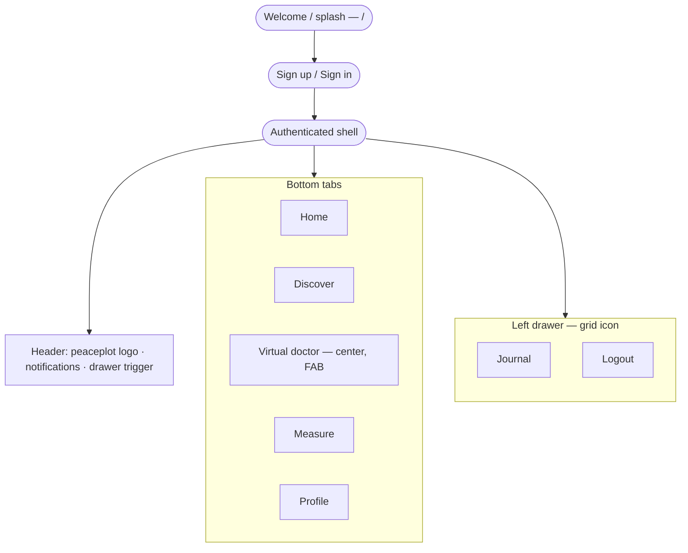
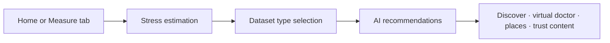

# PeacePlot — Product & build plan

This document is the **project-level plan** for the PeacePlot healthcare app (stress reduction). **Implementation work should follow this plan**, the **functional requirements** captured below, and the **`design/`**-based UI system (**§2**): **all** screens use that style, **dark theme** by default, **blue** primary accent.

Companion document: [`research.md`](./research.md) (industry notes and design rationale).

---

## 1. Vision

Help users **understand and reduce stress** through **AI-assisted estimation**, **character-aware** guidance, a rich **Discover** library, and a **virtual doctor** experience—delivered in a **calm, trustworthy** mobile-first experience. **Home** is the **landing** hub (doctor quotes + **2×2 Measure** grid); **Profile** and **Virtual doctor** sit in the **bottom tab bar**; **Journal** and other utilities live in the **left drawer**. **Every feature and page** should follow the **`design/`** templates (structure, spacing, typography, cards, lists, navigation) and the **dark + blue** theme (**§2**). Industry patterns from established wellness apps inform defaults only where this plan does not specify otherwise.

---

## 2. Design source of truth (`design/` folder)

### 2.0 Mandatory compliance — all features & pages

Building the app in Expo is **not** a greenfield visual redesign. The repo’s **`design/`** tree contains **many** HTML templates under **`design/xhtml/`** (auth, feeds, profile, settings, messaging, UI kits, etc.). Implementation **must**:

1. **Match the template style** — For each PeacePlot screen, identify the **closest** `design/xhtml/*.html` (or component pattern in `assets/css/style.css` / SCSS sources) and mirror **layout** (header, content area, lists, cards, forms, tabs, drawer), **density**, and **interaction rhythm** (e.g. scrollable body, fixed header, bottom bar safe area).
2. **Default theme: dark + blue** — Ship **dark surfaces** and **blue** primary (`§2.2`) as the **product default**. Do **not** use the template’s **orange** default accent for PeacePlot UI. **Light mode** is implemented app-wide (`§2.2`, `§6`): users can switch via the drawer **Dark Mode** toggle; palettes map to **`.theme-dark`** vs **`_variable.scss` / `:root`** light surfaces so auth and welcome screens stay aligned with the HTML templates.
3. **Tokens, not one-off hex** — Map UI to the **§2.2** token set (aligned with `_theme-color.scss` **blue** preset and `_theme-view.scss` **`.theme-dark`**). New components should look like they belong beside existing **template-derived** screens.
4. **PeacePlot branding** — Replace template logos with **`assets/images/`** assets (**§2.4**); keep layout from **`design/`**.

Screens that bypass this system require an **explicit plan change** (see **§9**).

### 2.1 What’s in the repo

The **`design/`** tree is the **Mobile Soziety–style** template (Bootstrap 5 + SCSS + static HTML). Treat it as **layout and component vocabulary**, not as shipped code:

| Area                      | Location                                                                 | Use for PeacePlot                                                                                                                                         |
| ------------------------- | ------------------------------------------------------------------------ | --------------------------------------------------------------------------------------------------------------------------------------------------------- |
| **Compiled UI & pages**   | `design/xhtml/` — HTML screens, `assets/css/style.css`, images           | Screen structure: `header` / `main-bar`, `page-wraper`, lists, cards, forms, tabs, **sidebar/offcanvas** patterns for the drawer, bottom tab bar density. |
| **Theme tokens (source)** | `design/xhtml/assets/scss/layout/theme/_theme-color.scss`                | Accent palettes via `data-theme-color="color-*"` presets.                                                                                                 |
| **Dark theme overrides**  | `design/xhtml/assets/scss/layout/theme/_theme-view.scss` (`.theme-dark`) | Dark surfaces, text, borders, form fields, header behavior.                                                                                               |
| **Global variables**      | `design/xhtml/assets/scss/abstracts/_variable.scss`                      | Typography, radii (`--border-radius-base` ≈ 12px), `:root` CSS variables.                                                                                 |
| **Vendor docs**           | `design/documentation/`                                                  | Installation and folder overview only.                                                                                                                    |

**Fonts:** **Nunito Sans** and **Poppins** (see `design/xhtml/index.html`). Plan to load the same (or closest Expo equivalent) for parity.

**Behavioral note:** The template toggles dark via **`body.theme-dark`**. PeacePlot **defaults to dark**; runtime **light** follows **`_variable.scss`**-style page/field colors (**§2.2**).

### 2.2 Product direction: dark theme + blue accent (and light companion)

The template’s default accent is **orange** (`#FE9063` in `_variable.scss`). **PeacePlot uses blue primary in both schemes:**

- **Accent (use `color-blue` block in `_theme-color.scss`):** `--primary` `#2196f3`, `--primary-hover` `#0c7cd5`, `--primary-dark` `#064475`, `--primary-light-2` `#8ecdff`, blue `--gradient*` / `--rgba-primary-*` (unchanged in light vs dark).
- **Dark (`.theme-dark` / feed-style tuning in app):** page / drawer / tab bar unified **`#243457`**, cards ~**`#2d405c`**, text **`#fff`** / body **`rgba(255,255,255,0.7)`**, borders **`rgba(255,255,255,0.2)`**, muted **`rgba(255,255,255,0.5)`** — implemented as **`PeacePlotPalettes.dark`** in **`src/theme/peaceplot-theme.ts`**.
- **Light (`:root` / `_variable.scss`):** page **`#f5f7fb`**, cards/inputs **`#ffffff`**, headings/text **`#2f2f2f`**, borders **`#e6e6e6`**, muted **`#aeaed5`**, secondary surfaces **`#eef2f7`** / **`#e8eff3`** where needed — implemented as **`PeacePlotPalettes.light`** (same module).
- **Rule:** Implement **blue** consistently; do not ship the template’s orange primary unless the owner revises this plan.

**Runtime:** **`PeacePlotAppearanceProvider`** (`src/providers/peaceplot-appearance.tsx`) persists **`peaceplot-appearance`** in **AsyncStorage** (default **dark**). **`usePeacePlotColors()`** returns the active palette; **`ThemeProvider`** + **Navigation** use **`getPeacePlotNavigationTheme(scheme)`**. The drawer **Dark Mode** `Switch` updates **`scheme`** app-wide.

### 2.3 Expo translation (plan-level)

- **Single theme module** (`src/theme/peaceplot-theme.ts`) mirroring §2.2 **dark and light** palettes—applied **globally** via **`PeacePlotAppearanceProvider`** so every route shares the same tokens and **blue** accent (**§2.0**).
- **Components** rebuilt from **`design/xhtml/`** with React Native + shared primitives; match **spacing, ~12px radius, header and bottom bar structure** for **all** tab roots and stacked screens.
- **Gradients:** `expo-linear-gradient` (or equivalent) for blue gradients from `_theme-color.scss`.
- **Icons:** One consistent approach (`@expo/vector-icons` and/or SVG); map roles (nav, header actions, status), not necessarily every template glyph.
- **Branding & loading:** Use repo assets in **`assets/images/`** per **§2.4** (not the Soziety template logos).

### 2.4 PeacePlot brand assets & loading animation

**Canonical paths (repo root–relative):**

| Asset                         | Path                                                                                              | Use                                                                                                                                                                                                                                                                                                                                                                                                                                                                                          |
| ----------------------------- | ------------------------------------------------------------------------------------------------- | -------------------------------------------------------------------------------------------------------------------------------------------------------------------------------------------------------------------------------------------------------------------------------------------------------------------------------------------------------------------------------------------------------------------------------------------------------------------------------------------- |
| **Primary logo**              | **`assets/images/brand/peaceplot.png`**                                                           | **Header** (§4.1), **auth / welcome** branding, **drawer** header, **splash** companion if a wordmark is needed beside the loading mark, **share** previews where appropriate.                                                                                                                                                                                                                                                                                                               |
| **Loading / splash mark**     | **`assets/images/brand/peaceplot-loading.png`**                                                   | **App launch splash**, **full-screen loading** states (initial data fetch, auth bootstrap, heavy transitions), and **inline blocking loaders** where a centered brand treatment is preferred over a bare spinner.                                                                                                                                                                                                                                                                            |
| **Auth hero (sign-up)**       | **`assets/images/auth/pic1.jpg`**                                                                 | **Sign-up** screen top photograph; mirrored from **`design/xhtml/assets/images/auth/pic1.jpg`**.                                                                                                                                                                                                                                                                                                                                                                                             |
| **Auth wave divider (dark)**  | **`assets/images/auth/bg-shape-dark.png`**                                                        | Wavy edge between hero and form (**dark** scheme), matching **`design/xhtml/`** `.theme-dark .welcome-area .join-area:after` / **`bg-shape-dark.png`**.                                                                                                                                                                                                                                                                                                                                      |
| **Auth wave divider (light)** | **`assets/images/auth/bg-shape.png`**                                                             | Same structural role for **light** scheme (mirrors **`design/xhtml/assets/images/bg-shape.png`** on non-dark welcome/join areas).                                                                                                                                                                                                                                                                                                                                                            |
| **Auth hero (sign-in)**       | **`assets/images/auth/pic4.jpg`**                                                                 | **Sign-in** hero photo; mirrored from **`design/xhtml/assets/images/auth/pic4.jpg`** (`login.html`).                                                                                                                                                                                                                                                                                                                                                                                         |
| **OAuth glyph assets**        | **`assets/images/auth/facebook.png`**, **`assets/images/auth/google.png`**                        | **Sign-in** “Or sign in with” row; mirrored from **`design/xhtml/assets/images/icons/`**.                                                                                                                                                                                                                                                                                                                                                                                                    |
| **Doctor quote gallery**      | **`assets/images/landing/quotes/1.png`** … **`5.png`**                                             | **Home** doctor-quotes slider (**§4.3**): image-only carousel using full quote artwork cards (**no avatar/name/role block**). Quote cards use the source aspect ratio (**1376×768**, ~16:9) and **`contentFit: contain`** so the entire image stays visible without vertical crop. Implemented in **`src/components/home/doctor-quotes-slider.tsx`** with **`expo-image`**.                                                                                                               |
| **Ambient shell**             | **`assets/images/landing/background-light.gif`**, **`assets/images/landing/background-dark.gif`** | **Light** and **dark** appearances each use a **full-screen looping GIF** (`PeacePlotAmbientBackground`): **`expo-image`** `contentFit: cover`, priority **high**. **Light** scrim ~**14%** neutral white (avoid heavy overlays that wash out the art). **Dark** scrim ~**38%** **`#243457`** tint for legibility on top of the dark GIF. **Drawer** / **tabs** / **estimate**: transparent **`sceneStyle` / `contentStyle`**. **Welcome / sign-in / sign-up** unchanged (§2.4 auth heroes). |

**Visual fit with §2.2:** The logo artwork is **blue-forward** with **gold / highlight** accents and **liquid / water** motifs (wordmark and circular mark with lotus). Implementation should place both assets on **dark** surfaces from **§2.2** so cyan–gold gradients read clearly; avoid light-gray page backgrounds behind **`peaceplot-loading.png`** unless the PNG is exported with **true transparency** for dark UI.

**Loading animation (quality bar — calm, premium, not frantic):**

- **Primary treatment:** Animate **`peaceplot-loading.png`** with a **slow “breathing” scale** (e.g. subtle pulse on the central orb) and/or **soft opacity oscillation** on a **long period** (2.5–4s) so it feels meditative, not like a system busy indicator.
- **Secondary accents (optional, pick one or combine lightly):** **Gentle shimmer** (moving linear gradient mask or very low-amplitude highlight sweep) across the liquid/water areas; **slow rotation** only if it matches the asset’s circular splash frame—keep **RPM low** (e.g. one full turn in **20–40s**) or **none** if rotation feels gimmicky.
- **Entry / exit:** Short **fade-in** when showing loading; **fade-out** or **crossfade** into content—avoid **hard cuts** that spike stress in a stress-reduction app.
- **Duration:** Cap **splash** display (e.g. hide when app is ready, with a **maximum** time before showing UI even if a resource is slow); avoid infinite logo spinners on cold start.
- **Accessibility:** Respect **Reduce motion** OS settings: replace or dampen scale/rotation/shimmer with a **static** centered image + optional **minimal** progress indicator.
- **Tech note (implementation):** Prefer **`react-native-reanimated`** (or Expo-supported animation APIs) for 60fps-friendly transforms; for web, **CSS** `@media (prefers-reduced-motion: reduce)` mirrors the same intent.

**Do not** reuse **`peaceplot-loading.png`** as the small header glyph—**`peaceplot.png`** is the **navigation / UI chrome** logo; **`peaceplot-loading.png`** is for **large, centered loading / splash** contexts.

### 2.5 Reference HTML files (patterns, not 1:1 pages)

- **Auth:** `login.html`, `register.html`, `welcome.html`, `otp-confirm.html`. **`welcome.html`** → **§4.4.2** (`/`); **`login.html`** sign-in layout → **§4.4.3** (`/signin`).
- **Profile / settings:** `account.html`, `setting.html`, `profile.html`.
- **Feeds, lists, notifications:** `index.html`, `notification.html` — density for **Discover** and list-heavy surfaces.
- **Drawer / menu:** Template **menu-toggler** / offcanvas patterns — map to **left drawer** triggered by the header grid icon (§4.2).
- **Messaging / social:** `message`-related HTML where present — patterns for **chat rooms** and **chatbot** threads.

---

## 3. Core product logic & user journey

### 3.1 Main point (system behavior)

1. **AI-driven stress estimation** produces a result that, together with **character profile** data, feeds **automatic recommendations** for stress-relief methods.
2. **Gating step (required):** After stress estimation completes and **before** the user receives **AI recommendations**, they must **select which dataset types** they are interested in (see §5.2). Recommendations are then scoped or weighted by those choices.
3. **Optional voice assistance (phased):** If included, a **voice-forward assistant** may help with navigation or starting flows—**not** a substitute for the **Measure** entry points. **Audio** in PeacePlot means **voice / audio input used for stress measurement** (e.g. speech-to-text), **not** a standalone music or entertainment hub (§4.2, §5.1, §5.5).
4. **Location-aware suggestions:** Recommend **local “famous” or notable places** that may help ease stress, **scoped by country or locality** (privacy, permissions, and data sourcing to be defined in implementation).
5. **Trust layer:** Surface **credentialed or “famous stress doctor”** content (biographies, articles, books, videos, speeches) to build user confidence (§5.4).

### 3.2 Typical journey (high level)

**Cold start:** The app opens on **`/`** — **Welcome** (splash + marketing carousel + auth CTAs; **§4.4.2**), then **sign-up** / **sign-in** as needed.

**Navigation shell** (after sign-in): one **header**, **five bottom tabs**, and a **left drawer** from the grid icon (§4.1–4.2).

**Core loop** (stress → recommendations → content):

Repeat visits: **Home** for landing (doctor quotes, **2×2 Measure** grid) and quick entry; **Discover** for the library; **Virtual doctor** (center **FAB**) for guided wellness; **Measure** for the stress-measurement hub (tab immediately **right** of Virtual doctor); **Profile** for account settings; **Journal** / **Logout** and other items from the **left drawer** (§4.1). **Profile** is also reachable from the drawer **Main menu** (switches to the **Profile** tab).

### 3.3 Character analysis

- **Purpose:** Inform **personalization** of estimation interpretation and recommendations.
- **Mechanism:** **Question-based** flows (“questions or similar”)—can be a dedicated flow and/or ongoing prompts; results feed the **character** model used with estimation outputs.

---

## 4. Information architecture, page structure & behavior

This section fixes **navigation** and **shell UI** so implementation matches the owner’s spec while staying aligned with **`design/`** (fixed header, bottom tabs, drawer).

### 4.1 Global shell (most authenticated screens)

- **Layout:** Follow **`design/xhtml/`** `page-wraper` + **fixed header** + **scrollable content** + **bottom tab bar** (template bottom navigation spacing and safe areas).
- **Header — left:** App logo **`assets/images/brand/peaceplot.png`** (not the Soziety template logo). Scale for header height; preserve aspect ratio.
- **Header — right (two actions + drawer):**
  1. **Notifications** — opens the **Notifications** screen (`/notifications`, drawer stack route); future list/detail pattern like `notification.html`; wired in **`AppHeader`**.
  2. **Four-square (grid) icon** — opens a **left-side drawer** (off-canvas menu). Visual and structural patterns follow the **Soziety-style** sidebar reference (blue user band, section labels, chevrons, settings block, footer)—see **§4.1.1** for what is implemented in the app. **Journal** stays out of the bottom tab bar; **Profile** is a tab and is also linked from the drawer (§4.2). **Chat** is not a header action (community/chat deferred; **Virtual doctor** tab covers guided wellness).

### 4.1.1 Left navigation drawer (implemented UI)

The Expo app implements the drawer in **`src/components/navigation/drawer-content.tsx`** with **`expo-router/drawer`** (`src/app/(drawer)/_layout.tsx`). Stack routes **`journal`** and **`notifications`** live beside **`(tabs)`** (e.g. **`src/app/(drawer)/notifications.tsx`**). The global tab header is **`src/components/navigation/app-header.tsx`** (logo, notifications → **`/notifications`**, drawer). Styling aligns with **`design/`** sidebar / offcanvas density and the **dark + blue** system (**§2.2**), using token **`drawerBody`** (deep navy, ~`#243460`) and **`drawerHeaderBlue`** (bright blue band, `#2196f3`).

| Region                | Behavior                                                                                                                                                                                                                                                                                                                                                                                                                                                |
| --------------------- | ------------------------------------------------------------------------------------------------------------------------------------------------------------------------------------------------------------------------------------------------------------------------------------------------------------------------------------------------------------------------------------------------------------------------------------------------------- |
| **Top (blue header)** | **User avatar** placeholder (rounded square, white border, person icon until Supabase profile photo). **Greeting** line: time-based (“Good Morning” / “Good Afternoon” / “Good Evening”). **Display name** placeholder: `Guest` until auth profile supplies a name.                                                                                                                                                                                     |
| **MAIN MENU**         | Section title (all-caps). Rows: **icon + label + optional badge + chevron**. **Home** → returns to the **Home** tab; **Profile** → opens the **Profile** tab; **Journal** → **`/journal`**; **Notifications** (badge `1`) → **`/notifications`** (same screen as header bell); **Logout** → **`supabase.auth.signOut()`** when configured, then **`router.replace('/signin')`** (**§4.4.3**). **Chat** row removed from the drawer (not in current IA). |
| **SETTINGS**          | Separator line. **Dark Mode** → `Switch` bound to **`PeacePlotAppearanceProvider`** (**persisted**); toggles **light/dark** palettes (**§2.2**) and navigation/chrome; product **default** remains **dark + blue**.                                                                                                                                                                                                                                     |
| **Footer (pinned)**   | **`PeacePlot`** (bold) and **`App Version {version}`** via **`expo-constants`** (falls back to `1.0.0` if unset).                                                                                                                                                                                                                                                                                                                                       |

The drawer width is ~**86%** of the screen (max **340px**). Rows use **Ionicons** for parity with vector icon usage elsewhere.

### 4.2 Bottom navigation (five tabs, fixed)

Order (left → right): **Home** · **Discover** · **Virtual doctor** (center **FAB**) · **Measure** · **Profile**.

| Tab                | Route / name     | Primary purpose                                                                                                                                                                                                                                                                                                                                              | Notes                                                                                                                                |
| ------------------ | ---------------- | ------------------------------------------------------------------------------------------------------------------------------------------------------------------------------------------------------------------------------------------------------------------------------------------------------------------------------------------------------------ | ------------------------------------------------------------------------------------------------------------------------------------ |
| **Home**           | `index`          | **Landing** experience: see **§4.3** (header, doctor-quotes slider, **2×2 Measure** grid). Entry to **stress estimation** and trust content.                                                                                                                                                                                                                 | Default tab after sign-in.                                                                                                           |
| **Discover**       | `discover`       | **Content library** (replaces “Relax Hub”): books, video, image, story, music, **Yoga & Tai Chi**, **AI advice**, location/places—browse and filter. Sleep-oriented audio (stories, soundscapes) may appear here as **content types**, not a separate tab.                                                                                                   | Dataset-type gating still applies before recommendations (§3.1).                                                                     |
| **Virtual doctor** | `virtual-doctor` | **Guided wellness conversation** / doctor-style support (AI and/or provider integrations **TBD**): education, triage into **Discover** content, crisis disclaimers—**not** emergency care. **Visual:** **center** tab bar control — **FAB**-style (raised circle, primary ring), icon-forward; label **“Doctor”** in **`PeaceTabBar`** where space is tight. | Scaffold: **`src/app/(drawer)/(tabs)/virtual-doctor.tsx`**. Implemented as the **emphasized center** tab in **`peace-tab-bar.tsx`**. |
| **Measure**        | `measure`        | **Stress measurement** hub — standard tab (icon + label) **immediately to the right** of Virtual doctor. Routes into the **same measurement modalities** as Home’s grid (camera, fingerprint, audio-for-measurement, question).                                                                                                                              | **Not** a music or entertainment tab; **audio** here = **capture for estimation** (speech-to-text), not playback library.            |
| **Profile**        | `profile`        | **Account**: userid, email, avatar, password, OAuth linkage, Supabase **`profiles`** row—patterns from **`design/xhtml/`** account/profile screens.                                                                                                                                                                                                          | Same screen reachable from the drawer **Profile** row (switches to this tab).                                                        |

**Removed from bottom navigation:** **Forum** and **Sleep** tabs (former community + sleep surface). Community/chat and sleep **content** may re-enter later via **Discover**, **Virtual doctor**, or drawer entries—**not** as dedicated bottom tabs.

**Removed from bottom navigation (vs. earlier drafts):** **Insight** tab — superseded by **Journal** in the **drawer** (§4.1). **Relax Hub** — renamed **Discover**. **Audio** tab — **removed**; audio is **only** a **modality under Measure / Home** for stress assessment, not a standalone tab.

**Expo routing note:** Map these to **`expo-router`** tab routes under a shared `(tabs)` layout with the **global header** and **theme** from §2. Tab order in **`_layout.tsx`** is **`index` → `discover` → `virtual-doctor` → `measure` → `profile`** so **Virtual doctor** is the **middle** slot and **Measure** sits **next** to it on the right. **`PeaceTabBar`** applies the **FAB** treatment to **`virtual-doctor`** only (`centerFab` / `centerFabWrap` styles).

### 4.3 Major screens (by feature area)

**Home — landing page (primary dashboard):**

- **Header:** Unchanged from **§4.1** (`peaceplot.png` left; notifications, grid/drawer right — no chat icon).
- **Famous doctors — slider / carousel:** Visual quote gallery using **`assets/images/landing/quotes/1.png`–`5.png`** as the full card content (**image-only** slides; no avatar/name/role block). **Height/ratio are tuned to show the full image** (no top/bottom crop). Swipe with calm pacing; align with **§5.4**. _(Implemented in **`src/components/home/doctor-quotes-slider.tsx`**.)_
- **Measure — 2×2 grid (hero):** Four large tappable tiles in a **two-column, two-row** layout. Each tile uses a **top photo strip** (**`expo-image`**, `contentFit: cover`) with a short **title + subtitle** block on the card below—rounded corners, **§2.2** card/border colors, primary border on press. **Landing assets** (repo: **`assets/images/landing/`**): **`camera.jpg`**, **`fingerprint.jpg`**, **`voice.jpg`** (audio-for-measurement). **Questions** uses a **theme-backed placeholder** (primary-dark panel + help icon) until an optional **`questions.jpg`** (or similar) is added and wired in **`measure-grid.tsx`**. Copy per tile:
  1. **Camera** — face / visual capture for estimation (privacy consent before first use).
  2. **Fingerprint** — biometric path as defined in product (signal or quick check-in per §5.1).
  3. **Audio** — **microphone / voice capture for stress measurement only** (speech-to-text or voice questionnaire)—**not** music playback; imagery must not imply “streaming” or “podcast.”
  4. **Question** — structured questionnaire / check-in.
- Tapping a tile opens the **corresponding estimation flow** (stacked screens or modal). The **Measure** tab (§4.2) should offer the **same four modalities** for users who start from the tab bar.

**Stress estimation (modal flow or stacked screens — from Home grid or Measure tab):**

- Inputs: **questions**, **speech-to-text (audio-for-measurement)**, **camera (face)**, **fingerprint**; **smart watch** phased (§7).
- **Mandatory intermediate screen:** **Dataset type selection** **after** estimation, **before** recommendation results.
- **Audio measurement (implemented path):** **`AudioMeasureFlow`** (`src/components/estimate/audio-measure-flow.tsx`) — **`expo-audio`** records a clip on press/hold and returns a file URI on release; **`expo-speech-transcriber`** (plugin with speech + mic purpose strings in **`app.json`**) transcribes **after recording** from that URI. The library **does not run in Expo Go** — use a **development build** (`expo run:ios` / `expo run:android`). **English (`en_US`)** only per upstream limits. Split into **two clear steps** on one route:
  - **Step 1 — Capture:** **Press and hold** the **“Professional audio”** control; recording starts on press-in and stops on release (or max duration). While recording: **circular time progress** (0→max) via **`react-native-svg`**, **live waveform** bars, and **pulsing rings** (Reanimated). If the user releases before capture starts (e.g. permission still in flight), the take is **aborted** safely.
  - **Step 2 — Review:** After release, a **review** card shows duration and **playback** (when a file URI exists). **“Next step”** transcribes from the recorded URI (`transcribeAudioWithSFRecognizer`, then **`SpeechAnalyzer`** if available and primary text is empty on iOS), merges with **`mock-voice-estimation`** stress band (`src/lib/mock-voice-estimation.ts`), optionally calls **Gemini** (`EXPO_PUBLIC_GEMINI_API_KEY`, **`src/lib/gemini-voice.ts`**) for a short **wellness reflection**, stores full text in **`src/lib/voice-estimate-session.ts`** for **`/estimate/result`**, then navigates to **`/estimate/dataset-types`** (gating per §3.1 / §5.2).
  - **After gating:** **`/estimate/result`** shows **transcript** + **Gemini reflection** when configured; stress score remains **placeholder** until **Supabase Edge Functions** (§6.1) replace heuristics.

**Recommendations & AI advice:**

- Results screen(s) after gating: personalized **methods** and **content pointers** into **Discover** / **Virtual doctor** / trust content as appropriate.
- **AI advice** as a **content type** and/or **inline** assistant copy—consistent with trust disclaimers (no medical claims unless compliance allows).

**Discover** (library; former Relax Hub):

- **Books:** “Normal peaceful” books and **books from famous doctors** (filter or badges).
- **Media:** video, image, **story** (narrative content; audio tracks for stories may live here as **content**, distinct from **measurement** audio on Home).
- **Music** as **library content** (Discover), not the **Measure** audio modality.
- **Activities:** **Yoga**, **Tai Chi**.
- **Places:** **Location-based** “famous places” (map/list), permission-gated.

**Virtual doctor** (tab — `virtual-doctor`):

- **Purpose:** A dedicated surface for **doctor-style wellness guidance** (AI and/or human-provider flows **TBD**): education, gentle check-ins, routing users to **Discover** content, and clear **non-emergency** disclaimers. Not a replacement for crisis lines or clinical care.
- **Implementation:** Scaffold at **`src/app/(drawer)/(tabs)/virtual-doctor.tsx`**; expand per trust/safety review (**research.md** §3, §9).

**Journal** (drawer — not a tab):

- **Reflective journaling**, entries, and optional ties to **stress check-ins** or **character** prompts. **Stress history / trends** (if not on Home or Discover) may link from Journal or a drawer sub-page—finalize IA in design lock.

### 4.4 Authentication & account (behavior)

- **Sign-up fields (UI):** unique **`userid`**, **`email`**, **`password`**, and later **`avatar`** (Storage URL in **`profiles`**, not a column for raw uploads).
- **`userid`:** **Globally unique**; **validate uniqueness** before completion (client **`is_userid_available` RPC** when present + **Postgres** unique index on **`profiles.userid`**).
- **OAuth providers:** **Google**, **Outlook (Microsoft)**, **Apple** — in addition to or paired with email/password per platform policy.
- **Sign-in / recovery:** Flows consistent with **`design/xhtml/`** auth pages and §2.2 styling.

#### 4.4.0 Supabase data model (what you see in the Dashboard)

After **Register**, **Supabase Table Editor → `public.profiles`** shows a row with **`id`** (same UUID as **`auth.users`**), **`userid`**, **`email`**, and **`created_at`**. This is **expected**.

- **Email and password (credentials):** Stored **only** in Supabase **Auth** (`auth.users`). The password is **hashed** by Supabase Auth and **must never** appear in **`public.profiles`** or any app-managed column.
- **`public.profiles`:** App-facing profile row: **`id`**, **`userid`** (public handle), **`email`** (denormalized copy from Auth for SQL joins, future **search by email**, and admin/reporting), **`created_at`**. Populated by the **`handle_new_user`** trigger on **`auth.users`** insert (see **`supabase/migrations/`**).
- **Email confirmation:** **Off** for PeacePlot: **Dashboard → Authentication → Providers → Email** — disable **Confirm email** so **new** **`signUp`** calls return a **session** immediately. Turning this off does **not** retroactively set **`email_confirmed_at`** on **existing** `auth.users` rows. Those accounts can still get **“Email not confirmed”** on **`signInWithPassword`** until you either: **(1)** open **Authentication → Users**, select the user, and **confirm the email**; or **(2)** run the one-time SQL migration **`supabase/migrations/20260415120000_backfill_auth_email_confirmed_at.sql`** in the SQL Editor to set **`email_confirmed_at`** for all still-null rows. The app’s auth error copy points here instead of implying a new inbox link when confirmation is already disabled.
- **Sign-in errors:** **`src/lib/auth-errors.ts`** maps Supabase messages without telling users to “check email” for a confirmation flow that the project has turned off; unconfirmed-legacy cases reference **Users** in the Dashboard or the **backfill** migration above.

#### 4.4.1 Sign-up screen (implemented UI)

- **Routes:** **`/signup`** (`src/app/signup.tsx`); **`/signin`** — full sign-in UI (**§4.4.3**).
- **Template reference:** Layout follows **`design/xhtml/register.html`** and the **`welcome-area` / `join-area`** pattern (see `design/xhtml/assets/css/style.css` under `.welcome-area`), with **dark + blue** tokens (**§2.2**) instead of the template’s orange primary.
- **Hero & wave:** Top **~40%** viewport uses **`assets/images/auth/pic1.jpg`**; the form sheet overlaps the hero with **`bg-shape-dark.png`** (dark) or **`bg-shape.png`** (light) as the **liquid** transition strip (same roles as template dark vs light welcome/join).
- **Fields:** **Unique user ID** (maps to **`userid`** in **§4.4**), **email**, **password** with **show/hide** toggle; leading **icon boxes** use **blue** surfaces (`primaryDark` / primary family), not orange.
- **Primary button:** Full-width **REGISTER** using **`primary`** + **`textOnPrimary`** (`#2196f3` fill, white label).
- **Footer:** “Already have an account? **Sign in here**” links to **`/signin`**.
- **Join-area layout (no `HERO_RATIO` change):** Reduced vertical padding/margins on the form block (title block, fields, **REGISTER**, footer) and slightly tighter input row height so the bottom section aligns like the template reference and fits one viewport on common phones; **`ScrollView`** kept for keyboard and very small screens.
- **Backend:** When **`EXPO_PUBLIC_*`** Supabase env vars are set, **Register** calls **`supabase.auth.signUp`** with **`options.data.userid`**; **`profiles`** receives **`userid`** + **`email`** from the Auth trigger (**§4.4.0**). **`userid`** uniqueness is enforced in **Postgres** (unique index + trigger error on conflict).

#### 4.4.2 Welcome & launch (implemented UI)

- **Route:** **`/`** — **`src/app/index.tsx`** (default screen on app open).
- **Template reference:** **`design/xhtml/welcome.html`** — **`loader-screen`** (splash) then **`content-body`** → **`welcome-area`** (**`bg-image`** + **`join-area`** with swiper, pagination, **CREATE ACCOUNT**, **SIGN IN**, forgot link).
- **Splash phase (~2.6s, capped):** Full-screen **palette `background`** (light or dark); centered **`assets/images/brand/peaceplot-loading.png`** with a gentle **scale “breath”** (**`react-native-reanimated`**, aligned with **§2.4** motion bar); tagline **`YOUR PATH TO STRESS-FREE LIVING`** in **`primaryLight2`** (copy aligned with the loading artwork).
- **Welcome phase:** Hero **`assets/images/auth/pic1.jpg`** (height from **`HERO_RATIO`** only — unchanged by this layout pass), **scheme-aware** wave (**`bg-shape-dark.png`** / **`bg-shape.png`**), **horizontal** carousel (**three** PeacePlot slides) + **dot** pagination (inactive dots use **`dotInactive`**), **CREATE ACCOUNT** (**`textOnPrimary`**) → **`/signup`**, **SIGN IN** (secondary button tokens) → **`/signin`**, **Forgot your account?** → placeholder alert (recovery flow TBD).
- **Join-area layout (no `HERO_RATIO` change):** Welcome body uses a **column `flex: 1`** under the hero (no outer vertical scroll); **`joinMain`** groups carousel + CTAs, **`joinInner`** uses **`justifyContent: 'space-between'`** so **Forgot** sits at the bottom; carousel viewport height is layout-tuned (**`CAROUSEL_H`**, not the hero). Tighter spacing on dots, buttons, and copy block so the screen fits **one viewport** on typical devices.
- **Root layout:** **`src/app/_layout.tsx`** registers **`index`** first; the previous standalone **`AnimatedSplashOverlay`** solid-color intro was **removed** so launch branding lives on the welcome route with **`peaceplot-loading.png`** per **§2.4**.

#### 4.4.3 Sign-in screen (implemented UI)

- **Route:** **`/signin`** — **`src/app/signin.tsx`**.
- **Template reference:** **`design/xhtml/login.html`** — **`welcome-area`** hero + **`join-area`**: title + intro, **email** + **password** fields (password visibility toggle), **Forgot Password** (right-aligned row), **SIGN IN**, **Or sign in with** + **Facebook** / **Google** glyphs, footer **Don’t have an account? Signup here** → **`/signup`**.
- **Styling:** Same patterns as **`/signup`** (**§2.2** tokens, scheme-aware wave, **`surfaceInput`** fields, primary **SIGN IN** with **`textOnPrimary`**)—not the template’s orange accent.
- **Assets:** Hero **`assets/images/auth/pic4.jpg`**; social **`assets/images/auth/facebook.png`**, **`google.png`** (from **`design/xhtml/assets/images/icons/`**).
- **Behavior:** **`supabase.auth.signInWithPassword`** when configured; success → **`router.replace('/(drawer)/(tabs)')`**. **Forgot Password** and **OAuth** buttons are **placeholders** until recovery + provider flows per **§4.4** / **§6.1**.
- **Layout:** Same as **Welcome** (**§4.4.2**): **`flex: 1`** page + **`formSheet`** with **`flex: 1`** / **`minHeight: 0`**, **`formInner`** **`justifyContent: 'space-between'`** (main block + footer row)—**no outer `ScrollView`** so the bottom sheet does not rubber-band vertically like a scroll page.

---

## 5. Feature scope (detailed)

### 5.1 Stress estimation — input modalities

| Modality           | Role                                      | Planning note                                                                           |
| ------------------ | ----------------------------------------- | --------------------------------------------------------------------------------------- |
| **Questions**      | Structured assessment                     | Core; drives scoring with AI layer.                                                     |
| **Speech-to-text** | Voice answers for **stress measurement**  | Core; **Measure** / **Home** audio tile—**not** a separate music/entertainment feature. |
| **Camera (face)**  | Signals for estimation (or future affect) | **Privacy-sensitive**; explicit consent, platform rules, phased delivery.               |
| **Fingerprint**    | Biometric convenience or signal           | Often **auth** vs. stress signal—clarify product intent; platform APIs; phased.         |
| **Smart watch**    | Physiological or activity context         | Integrate via HealthKit / Health Connect / wearables APIs; phased.                      |

Estimation **combines** available signals with **AI** to produce results used in §3.

### 5.2 Datasets (Discover / recommendations)

- **Books:** Leisure/peaceful reading + **doctor-curated** lists.
- **Media:** Video, image, **story** (with **audio**), **music**.
- **Activities:** **Yoga** and **Tai Chi**.
- **AI advice:** Short, actionable suggestions (template + model behavior TBD).
- **Ordering:** User **selects interested dataset types** after estimation and **before** full recommendation generation (§3.1).

### 5.3 Communities (deferred — not in bottom nav)

- **Forum / chat rooms / public articles** are **out of scope for the current tab IA** (removed from §4.2). If brought back, expect **opt-in discoverability**, **blocking**, and **moderation** (research §9); **search by email** is high-risk and needs policy.
- **Chatbot-style help** may live under **Virtual doctor** or **Discover** rather than a separate **Forum** tab.

### 5.4 Trust — “famous stress doctors”

- **Content types:** Biographies, articles, books, videos, speeches.
- **Surface in:** Home (slider), **Discover**, **Virtual doctor**, dedicated drawer entries as appropriate.

### 5.5 Voice as input (measurement) — not a standalone “Audio” product area

- **In-scope:** **Microphone** and **speech-to-text** as inputs to **stress estimation** (Home **Audio** tile, flows launched from **Measure** tab). Clear **mic** consent, recording states, and error handling.
- **Out of scope for “Audio tab”:** There is **no** bottom tab for music, podcasts, or a generic voice assistant. **Playback** of sleep sounds, stories, or other Discover media belongs under **Discover** (content types), not under “audio measurement.”
- **Optional later:** A **voice assistant** that navigates the app or starts **Measure** remains **optional** and secondary to touch—if added, it does not replace the **Measure** hub semantics above.

### 5.6 Sleep content (no dedicated tab)

- **Purpose:** Sleep-related **soundscapes**, **stories**, and **wind-down** remain valuable product ideas (**`research.md`** §6); they are **not** a separate bottom tab in the current IA.
- **Placement:** Surface sleep **content types** inside **Discover** (filters/collections) and/or link from **Virtual doctor** where appropriate—avoid duplicating a whole parallel “Sleep app” unless product scope expands again.

---

## 6. Technical context (repository)

- **Stack:** Expo (~55), React Native, **expo-router** for navigation.
- **Platforms:** iOS, Android, Web (per Expo config).
- **Structure:** **Default route** **`/`** — Welcome (**§4.4.2**); tab layout for **§4.2** (**Home**, **Discover**, **Measure**, **Virtual doctor**, **Profile**); **drawer** for **§4.1** grid icon — **§4.1.1** layout (user header, MAIN MENU incl. Home / Profile / Journal / Notifications / Logout, SETTINGS, footer); drawer stack routes **`journal`**, **`notifications`**; stack routes **`signup`** (**§4.4.1**) / **`signin`** (**§4.4.3**); shared header component **`AppHeader`** with **`assets/images/brand/peaceplot.png`**; **launch splash** on Welcome uses **`assets/images/brand/peaceplot-loading.png`** with motion per **§2.4**; **appearance** — **`PeacePlotAppearanceProvider`** + **`usePeacePlotColors()`** for **light/dark** (**§2.2**).

### 6.1 Backend: Supabase (single platform)

**Backend services are standardized on [Supabase](https://supabase.com/)** for the full product lifecycle: **Auth** (email/password, OAuth providers, session), **Postgres** (app data, RLS policies), **Storage** (avatars, media), **Realtime** (chat rooms, live updates), **Edge Functions** (optional: AI proxying, webhooks, integrations with third-party APIs without exposing secrets in the app).

**Environment configuration:**

- **`/.env.example`** — Committed template listing all required variables (no secrets). New developers copy it to **`.env`** and fill in project values.
- **`/.env`** — **Gitignored**; contains `EXPO_PUBLIC_SUPABASE_URL` and `EXPO_PUBLIC_SUPABASE_ANON_KEY` (and any optional `EXPO_PUBLIC_*` keys). Values come from **Supabase Dashboard → Project Settings → API**.
- **Expo rule:** Only variables prefixed with **`EXPO_PUBLIC_`** are available in the client bundle. The **`service_role`** key must **never** ship in the app; use it only in **Edge Functions**, **server scripts**, or **CI**, if at all.

**Client code:** `src/lib/supabase.ts` initializes the Supabase client with the anon key and **AsyncStorage** session persistence. **`AuthProvider`** (`src/providers/auth-session.tsx`) exposes session state, **`signInWithPassword`**, **`signUp`** (metadata `userid`; expects **immediate session** — **§4.4.0**), **`signOut`**, and **`resetPasswordForEmail`**. Use **`requireSupabase()`** in non-React modules when the backend is required; when env vars are missing, `supabase` is `null` and UI should explain configuration.

**SQL migrations (run in order in the Supabase SQL Editor):**

1. **`supabase/migrations/20260411120000_auth_profiles.sql`** — **`profiles`** (`id`, **`userid`**, **`email`**, **`created_at`**), **`is_userid_available`**, **`handle_new_user`** trigger on **`auth.users`**.
2. **`supabase/migrations/20260414120000_profiles_add_email.sql`** — If you created **`profiles`** before **`email`** existed: adds **`email`**, backfills from **`auth.users`**, and replaces **`handle_new_user`** to populate **`email`**. Skip redundant statements if your **`profiles`** already matches **§4.4.0**.
3. **`supabase/migrations/20260415120000_backfill_auth_email_confirmed_at.sql`** — One-time **`auth.users`** update so legacy accounts can sign in after **Confirm email** is disabled (**§4.4.0**).

**Feature mapping (high level):**

| PeacePlot area                              | Supabase capability                                                           |
| ------------------------------------------- | ----------------------------------------------------------------------------- |
| Sign-up / `userid` uniqueness / OAuth       | Auth + Postgres unique constraints + profiles table                           |
| Avatars                                     | Storage bucket + public/signed URLs                                           |
| Stress history, character, recommendations  | Postgres tables + RLS                                                         |
| Journal entries                             | Postgres + RLS (user-owned rows)                                              |
| Sleep sessions / preferences (if tracked)   | Postgres + optional Health sync via platform APIs                             |
| Virtual doctor sessions / messages (future) | Postgres + RLS + optional Edge Functions for AI                               |
| Deferred: forum, articles, chat rooms       | Not in current IA; Realtime if reintroduced                                   |
| Voice / STT / AI                            | Edge Functions (secrets in Supabase env, not in Expo); **measurement**-scoped |
| Location / places                           | Postgres + external APIs via Edge Functions if needed                         |

**Operational note:** Create the Supabase project early, apply schema and RLS in migrations (Supabase SQL editor or CLI), and align OAuth redirect URLs with the **Expo scheme** (`peaceplot` per `app.json`) and Supabase Auth settings.

---

## 7. Build phases (suggested)

1. **Design lock** — Freeze **§4** IA (five tabs + **Virtual doctor** center **FAB**, **Measure** beside it, **Home** landing, **Profile** tab, drawer **Journal**), **§2.0** compliance (every screen maps to a **`design/xhtml/`** pattern), **§2.2** tokens (dark + blue default), **`assets/images/brand/peaceplot.png`** / **`peaceplot-loading.png`** usage, and **§2.4** loading motion rules; list **design/** HTML references per surface.
2. **Shell & navigation** — **`expo-router`** default **`/`** Welcome (**§4.4.2**), tabs (**Home**, **Discover**, **Virtual doctor**, **Measure**, **Profile** — order **§4.2**), **custom tab bar** with **prominent center Virtual doctor** (§4.2), global **header** + **left drawer** per **§4.1.1** (Soziety-style sidebar, footer, settings row), stack **signup** (**§4.4.1**) / **signin** (**§4.4.3**), **theme** (§2), **splash + loading** per **§2.4**, placeholder inner screens.
3. **Supabase foundation** — Create project, configure **`.env`** from **`.env.example`**, wire **Auth** redirect URLs, baseline **schema** / **RLS** and **Storage** buckets per **§6.1**.
4. **Auth** — Email/password + **`userid` uniqueness** + avatar via **Supabase Auth** + profiles table; **OAuth** Google / Microsoft / Apple per **§6.1**.
5. **Home landing** — Header (§4.1), **doctor quotes** slider, **2×2 Measure** grid with **landing photos** + labels (see **`assets/images/landing/`** and **§4.3**) per **`measure-grid.tsx`**.
6. **Stress estimation (MVP)** — **Question** + **speech-to-text** paths; result persistence; **dataset type selection** → **recommendations** UI (can use mock AI); align **Measure** tab with same four modalities.
7. **Discover** — Library browsing by content type; hooks for **location** places.
8. **Journal** — Drawer **Journal** screens (entries, optional links to check-ins); **not** a tab.
9. **Virtual doctor** — Expand tab beyond scaffold: safe copy, AI/provider routing, links to **Discover**; see **§4.3** / **§5** (formerly forum/chatbot scope may fold in here).
10. **Profile** — Account settings, **`profiles`** integration, avatar upload.
11. **Trust content** — Doctor slider copy, **Discover** surfaces, **§5.4**.
12. **Additional estimation channels** — Camera, fingerprint, smartwatch as prioritized.
13. **Polish** — Accessibility, **loading/empty** states (reuse **`peaceplot-loading`** where full-screen; **§2.4** reduce-motion), performance, App Store privacy strings.

---

## 8. Out of scope until explicitly scheduled

- **Clinical claims** or regulated medical device positioning without legal review.
- **Full moderation** and **admin** tooling for large-scale forums (unless community features return to scope).
- **Deep wearable** or **lab** integrations beyond agreed phases.
- Features explicitly deferred from **§7** until pulled into a sprint.
- **Non-Supabase backends** for core data/auth (unless the plan is formally revised)—integrations should go through **Supabase** (e.g. Edge Functions) where possible.

---

## 9. Change control

Updates to scope or phases should be recorded **in this file** (dated notes or version history) so the repo stays the single plan reference.

---

_Last updated: 2026-04-18_
